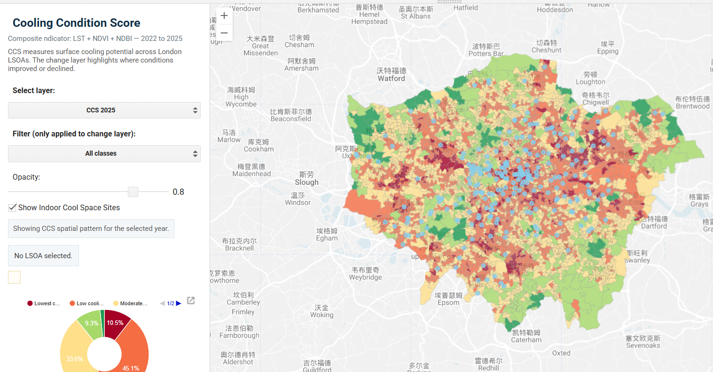
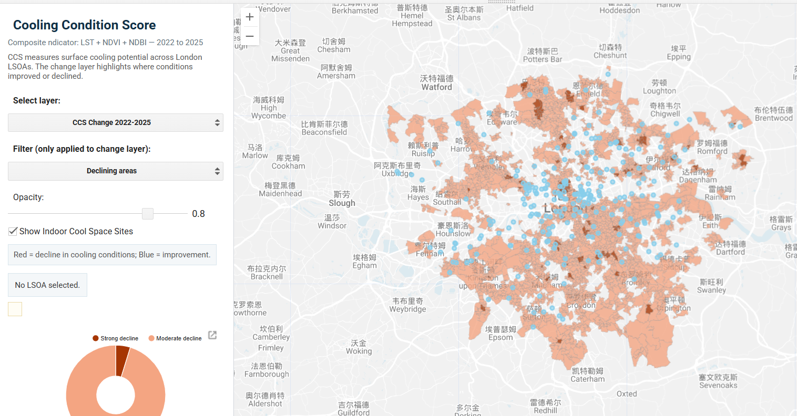
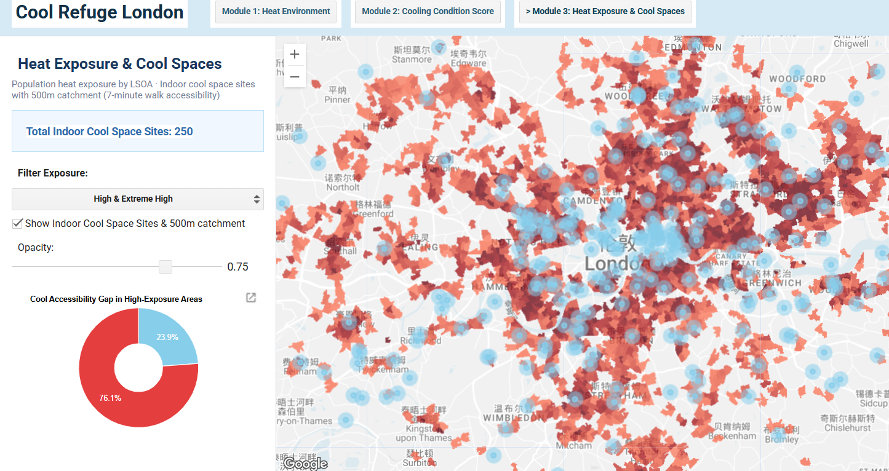

::: {.hero-banner}

Heat risk · Green infrastructure · Cooling access

# Cool Refuge London

**Where should London prioritise cooling interventions?**

:::

London's heat risk is not only about temperature. Vegetation cover, built surfaces, population exposure and access to cooling spaces all shape how heat is experienced locally. This project brings these layers together in an interactive web application to compare relative cooling conditions across London and identify where intervention may be more urgent.

::: {.metric-cards}

| | | | |
|---|---|---|---|
| <strong>6 Layers</strong><br><span>LST, NDVI, NDBI,<br>population density,<br>accessibility,<br>Cooling Condition Score</span> | <strong>10–30 m</strong><br><span>NDVI and NDBI at 10 m;<br>LST and Cooling Condition<br>Score at 30 m</span> | <strong>LSOA</strong><br><span>neighbourhood-scale<br>reporting for local<br>comparison</span> | <strong>GEE + Leaflet</strong><br><span>Earth Engine processing<br>and browser-based<br>web mapping</span> |

:::

## Project Summary

The project develops an application using Google Earth Engine for city planners and policymakers to evaluate urban cooling resilience across London at the LSOA level. The model calculates a Cooling Condition Score (CCS) using vegetation (NDVI), built-up (NDBI), and land surface temperature (LST) data, following the Equal Weighting Approach (EWA) established by Turner et al. (2025). Based on the London Policy G5 (Urban Greening) framework launched in 2021, this study investigates heat exposure and the distribution of official "Cool Spaces". By comparing these layers, the platform reveals the spatial alignment between cooling resources and actual neighborhood needs, helping to identify whether interventions are accurately directed at high-vulnerability areas. This provides a data-driven basis for targeted interventions and optimized resource allocation.

### Policy Context

This project is framed by **The London Plan 2021**, particularly its focus on managing heat risk, expanding urban greening and improving fair access to climate adaptation resources. Policy SI 4 treats overheating as a planning issue, while Policy G5 highlights urban greening as part of climate resilience. Together, these policies support the need for a spatial tool that can connect heat exposure, green infrastructure and cooling access.

| Policy / theme | Relevance to the application |
|---|---|
| London Plan Policy SI 4: Managing Heat Risk | Treats overheating as a planning concern. Land Surface Temperature is used to identify areas with stronger summer surface heat burden. |
| London Plan Policy G5: Urban Greening | Links urban greening with climate adaptation. NDVI is used as a remote-sensing indicator of vegetation-related cooling potential. |
| Good growth and access | Population density and cool-space accessibility help show where cooling resources may not align with local need. |


### Problem Statement

London faces rising heat risks due to the Urban Heat Island effect, creating an urgent need for neighborhood-level cooling research. While London Policy G5 (2021) set ambitious greening targets, evaluating their real-world impact at the LSOA scale remains difficult. Our application addresses this gap by offering a platform for planners to visualize Cooling Condition Scores (CCS) alongside official 2025 Cool Spaces. By bridging Turner et al.’s (2025) methodology with local governance, it supports evidence-based planning and ensures cooling resources reach the neighborhoods that need them most.

### End User

Our platform is designed for city planners, local councils, and community groups in London. These users need tools that are easy to use and help turn big policy goals into local action. For too long, the gap between climate research and neighborhood needs has made it hard to implement effective cooling. By providing an interactive dashboard instead of long academic reports, we make complex data easy to understand and use. This helps different groups work together to close the resilience gap across the city.

## Data

The project integrates environmental, demographic and accessibility datasets to support neighbourhood-scale cooling assessment across London. Land Surface Temperature represents surface heat burden; NDVI captures vegetation-related cooling potential; NDBI indicates built-surface intensity; heat exposure combines surface temperature and 2021 Census population count at LSOA level; cool-space accessibility reflects walking access to indoor cooling locations; and LSOA boundaries provide a consistent reporting geography for comparison and querying.

Raster layers are harmonised before index construction and aggregated to LSOA level, allowing pixel-based environmental information to be interpreted at neighbourhood scale for planning and spatial comparison.

| Indicator | Dataset | Description | Resolution | Source |
|---|---|---|---|---|
| **LST** | Landsat 8/9 Collection 2 Level-2 | Summer land surface temperature representing surface heat burden | 30 m | [GEE Catalog](https://developers.google.com/earth-engine/datasets/catalog/LANDSAT_LC08_C02_T1_L2) |
| **NDVI** | Sentinel-2 MSI Level-2A | Vegetation cooling potential | 10 m | [GEE Catalog](https://developers.google.com/earth-engine/datasets/catalog/COPERNICUS_S2_SR_HARMONIZED) |
| **NDBI** | Sentinel-2 MSI Level-2A derived NDBI | Built-surface intensity | 10 m | [GEE Catalog](https://developers.google.com/earth-engine/datasets/catalog/COPERNICUS_S2_SR_HARMONIZED) |
| **Cooling Condition Score** | Derived layer | Composite index combining standardised LST, NDVI and NDBI | 30 m / LSOA summary | Derived layer |
| **Heat exposure** | Derived layer | Combined 2021 surface temperature and census population count used in Module 3 | LSOA | Derived layer |
| **Cool spaces accessibility** | Cool spaces + catchment buffer | Indoor cool-space locations and derived walking accessibility layer | Vector | [London Datastore](https://www.london.gov.uk/programmes-strategies/environment-and-climate-change/climate-change/climate-adaptation/cool-spaces) |
| **LSOA boundary** | LSOA 2021 boundary | Reporting unit for zonal statistics and mapping | Vector | [ONS](https://geoportal.statistics.gov.uk/) |


## Methodology

The method is designed as a transparent environmental screening framework rather than a predictive heat-risk model. It follows recent urban heat vulnerability studies that prioritise interpretable composite indicators for neighbourhood comparison instead of calibrated forecasting models (Turner et al., 2025).

LST, NDVI and NDBI are first normalised to a common 0–1 scale, following standard composite indicator construction procedures where variables with different units are rescaled before aggregation (OECD, 2008). In urban remote-sensing research, these three indicators are commonly used together to represent surface heat intensity, vegetation cooling effects and built-surface concentration (Voogt and Oke, 2003; Ahmad et al., 2024; Rao et al., 2023).

LST and NDBI are treated as pressure indicators because higher values generally indicate stronger surface heat burden and greater built-surface intensity, while NDVI is reversed because higher vegetation levels reflect stronger cooling potential, consistent with remote-sensing heat-vulnerability frameworks where vegetation acts as a mitigating factor (Turner et al., 2025).

The **Cooling Condition Score** is calculated as:

$$
CCS = \frac{LST_{norm} + (1 - NDVI_{norm}) + NDBI_{norm}}{3}
$$

Equal weighting is applied because no validated local evidence currently supports assigning differentiated weights across the three indicators. This follows the equal weighting approach commonly used in environmental composite indices when transparency and comparability are prioritised over statistical weighting (OECD, 2008).

Heat exposure and cool-space accessibility are not included directly in the Cooling Condition Score. They are introduced afterwards as interpretation layers: heat exposure combines 2021 summer LST with census population count at LSOA level, while cool-space locations are assessed using a 500 m walking-distance buffer to compare relative local accessibility. Higher CCS values therefore indicate relatively poorer local cooling conditions, while lower values indicate relatively more favourable environmental cooling conditions.


```{=html}
<div class="method-svg-wrap">
<svg viewBox="0 0 860 430" xmlns="http://www.w3.org/2000/svg">
  <defs>
    <marker id="arrow" markerWidth="10" markerHeight="10" refX="8" refY="3" orient="auto">
      <path d="M0,0 L0,6 L8,3 z" fill="#23364d"/>
    </marker>
  </defs>

  <rect x="1" y="1" width="858" height="428" rx="26" fill="#f6fbfd" stroke="#d4e6ee"/>
  <text x="44" y="46" class="figure-label">Cooling Condition Score workflow</text>

  <rect class="svg-node node-heat" x="46" y="92" width="140" height="58" rx="15"/>
  <text x="116" y="116" text-anchor="middle" class="node-title">LST</text>
  <text x="116" y="136" text-anchor="middle" class="node-sub">surface heat burden</text>

  <rect class="svg-node node-green" x="46" y="174" width="140" height="58" rx="15"/>
  <text x="116" y="198" text-anchor="middle" class="node-title">NDVI</text>
  <text x="116" y="218" text-anchor="middle" class="node-sub">vegetation cooling</text>

  <rect class="svg-node node-built" x="46" y="256" width="140" height="58" rx="15"/>
  <text x="116" y="280" text-anchor="middle" class="node-title">NDBI</text>
  <text x="116" y="300" text-anchor="middle" class="node-sub">built intensity</text>

  <path d="M186 121 C218 121, 218 203, 246 203" class="flow-line"/>
  <path d="M186 203 L246 203" class="flow-line"/>
  <path d="M186 285 C218 285, 218 203, 246 203" class="flow-line"/>

  <rect class="svg-node node-process" x="266" y="167" width="132" height="72" rx="16"/>
  <text x="332" y="197" text-anchor="middle" class="node-title">Standardise</text>
  <text x="332" y="220" text-anchor="middle" class="node-sub">0–1 scale</text>

  <path d="M398 203 L448 203" class="flow-line arrow"/>

  <rect class="svg-node node-weight" x="468" y="167" width="132" height="72" rx="16"/>
  <text x="534" y="197" text-anchor="middle" class="node-title">Equal weight</text>
  <text x="534" y="220" text-anchor="middle" class="node-sub">1/3 each</text>

  <path d="M600 203 L650 203" class="flow-line arrow"/>

  <rect class="svg-node node-score" x="670" y="158" width="150" height="90" rx="18"/>
  <text x="745" y="193" text-anchor="middle" class="node-title">Cooling</text>
  <text x="745" y="216" text-anchor="middle" class="node-title">Condition Score</text>
  <text x="745" y="237" text-anchor="middle" class="node-sub">composite index</text>

  <path d="M745 248 L745 272 L332 272 L332 320" class="flow-line arrow"/>

  <rect class="svg-node node-aggregate" x="246" y="326" width="172" height="68" rx="16"/>
  <text x="332" y="354" text-anchor="middle" class="node-title">Aggregate to LSOA</text>
  <text x="332" y="377" text-anchor="middle" class="node-sub">reporting unit</text>

  <path d="M418 360 L468 360" class="flow-line arrow"/>

  <rect class="svg-node node-exposure" x="488" y="306" width="150" height="44" rx="13"/>
  <text x="563" y="327" text-anchor="middle" class="node-title small">Heat exposure</text>
  <text x="563" y="343" text-anchor="middle" class="node-sub small">LST + population count</text>

  <rect class="svg-node node-access" x="488" y="370" width="150" height="44" rx="13"/>
  <text x="563" y="391" text-anchor="middle" class="node-title small">Cool-space access</text>
  <text x="563" y="407" text-anchor="middle" class="node-sub small">500 m catchment</text>

  <path d="M638 360 L688 360" class="flow-line arrow"/>

  <rect class="svg-node node-output" x="708" y="326" width="112" height="68" rx="16"/>
  <text x="764" y="354" text-anchor="middle" class="node-title">Spatial</text>
  <text x="764" y="376" text-anchor="middle" class="node-title">Interpretation</text>
</svg>
</div>
```

The final output should be read as a relative screening layer rather than a direct thermal-comfort measurement. CCS supports comparison across neighbourhoods, while the additional heat exposure and accessibility layers help identify where poorer cooling conditions may coincide with higher resident exposure or weaker access to cooling resources.

## Interface

The interface is organised around layer comparison. Users can switch between urban heat environment, cooling condition accessment, and heat exposure & cool-space accessibility. The design intends to illustate a progressive causal chain: "The urban heat environment in London exhibits significant spatial imbalance between 2022 and 2025. Cool condition ratings reveal structural cold-warm zones, while population heat exposure analysis indicates a spatial mismatch between highly exposed populations and indoor cool resources."

The platform is structured around three thematic modules, navigable via a top bar. All modules share a consistent grey basemap and a floating legend panel, with layer opacity adjustable throughout.

Module 1: Heat Environment displays land surface temperature (LST), vegetation cover (NDVI), and built-up intensity (NDBI) derived from Landsat 8/9 and Sentinel-2 imagery for 2022, 2024, and 2025. Users can select indicators and years via dropdown menus, adjust layer opacity, and click any LSOA to retrieve zonal statistics. 

Module 2: Cooling Condition Score visualises a composite indicator combining LST, NDVI, and NDBI into a standardised cooling score, with options to view annual snapshots or the 2022–2025 change layer. A filter control isolates areas of decline or improvement, and a pie chart summarises the class composition of visible LSOAs. Indoor cool space sites are overlaid to identidy if there are enough indoor cool spaces in those areas that are getting hot. 

Module 3: Heat Exposure and Cool Spaces maps population-weighted heat exposure at LSOA level, overlaid with 500-metre accessibility catchments around indoor cool space venues (approximately a 7-minute walk, the human-centered design standard for heat relief access). A pie chart quantifies the proportion of high-exposure areas covered by cool space catchments, identifying spatial gaps in provision.

This design keeps the application accessible for non-technical users while still showing the analytical logic behind the final priority layer.

::: {#fig-interface layout-ncol=3}






By filtering indicators and overlaying layers, we found that most cool spots are located in areas with hotter environments. However, based on the overall score changes, the cooling conditions in most parts of London are deteriorating and have failed to effectively bridge the gap in cool spaces. Therefore, approximately 76% of the population still suffer from low cool accessibility.).
:::

## The Application

The embedded application below is the interactive front end of the project. With an interactive, module-based interface built on Google Earth Engine, integrating multi-year remote sensing data with spatial analysis to support environmental cooling conditions assessment across London.

```{=html}
<div class="app-wide">
  <iframe src="https://still-cipher-492419-m3.projects.earthengine.app/view/cool-refuge-london" loading="lazy"></iframe>
</div>
```

## How it Works

The final application is organised as a Google Earth Engine app with three linked modules. Module 1 compares the heat environment using LST, NDVI and NDBI. Module 2 displays the Cooling Condition Score and its change between 2022 and 2025. Module 3 combines the derived heat exposure layer with indoor cool-space sites and 500 m catchment buffers.

The code below shows simplified extracts from the final Earth Engine script. The full source code is provided in the GitHub repository.

### 1. Earth Engine assets

::: {.code-scroll}

```js
var london = ee.FeatureCollection(
  'projects/still-cipher-492419-m3/assets/London_GLA_Boundary'
);

var lsoa = ee.FeatureCollection(
  'projects/still-cipher-492419-m3/assets/LSOA_2011_London_gen_MHW'
);

var ccs = ee.FeatureCollection(
  'projects/casa0025-488411/assets/cri_change_lsoa'
);

var coolspace = ee.FeatureCollection(
  'projects/still-cipher-492419-m3/assets/CoolSpace_2025'
);

var lsoaExposure = ee.FeatureCollection(
  'projects/still-cipher-492419-m3/assets/London_HeatExposure_2021'
);
```

:::

### 2. Heat environment layers

::: {.code-scroll}

```js
function getLST(year) {
  var l8 = ee.ImageCollection('LANDSAT/LC08/C02/T1_L2')
    .filterBounds(london.geometry())
    .filterDate(year + '-05-01', year + '-08-31')
    .filter(ee.Filter.lt('CLOUD_COVER', 15));

  var l9 = ee.ImageCollection('LANDSAT/LC09/C02/T1_L2')
    .filterBounds(london.geometry())
    .filterDate(year + '-05-01', year + '-08-31')
    .filter(ee.Filter.lt('CLOUD_COVER', 15));

  return l8.merge(l9)
    .median()
    .clip(london)
    .select('ST_B10')
    .multiply(0.00341802)
    .add(149.0)
    .subtract(273.15);
}

function getVegBuilt(year) {
  var s2 = ee.ImageCollection('COPERNICUS/S2_SR_HARMONIZED')
    .filterBounds(london.geometry())
    .filterDate(year + '-05-01', year + '-08-31')
    .filter(ee.Filter.lt('CLOUDY_PIXEL_PERCENTAGE', 20))
    .median()
    .clip(london);

  return s2.normalizedDifference(['B8', 'B4']).rename('NDVI')
    .addBands(s2.normalizedDifference(['B11', 'B8']).rename('NDBI'));
}
```

:::

### 3. Cooling Condition Score layers

::: {.code-scroll}

```js
var ccsLayerConfig = {
  'CCS Change 2022-2025': {field: 'cri_change', type: 'change'},
  'CCS 2025': {field: 'cri25_mean', type: 'score'},
  'CCS 2024': {field: 'cri24_mean', type: 'score'},
  'CCS 2022': {field: 'cri22_mean', type: 'score'}
};

function getCCSStyled(layerName) {
  var cfg = ccsLayerConfig[layerName];

  if (cfg.type === 'change') {
    return ccs.map(function(f) {
      return classifyChange(f, cfg.field);
    });
  }

  return ccs.map(function(f) {
    return classifyScore(f, cfg.field);
  });
}
```

:::

### 4. Heat exposure and cool-space access

::: {.code-scroll}

```js
var coolspacePoints = coolspace.map(function(f) {
  return f.setGeometry(
    ee.Geometry.Point(
      [ee.Number(f.get('x')), ee.Number(f.get('y'))],
      'EPSG:27700'
    )
  );
});

var coolspaceBuffer = coolspacePoints.map(function(f) {
  return f.buffer(500);
});

var img = lsoaExposure.reduceToImage({
  properties: ['exposure'],
  reducer: ee.Reducer.first()
});
```

:::

### 5. Application structure

::: {.code-scroll}

```js
var moduleNames = [
  'Module 1: Heat Environment',
  'Module 2: Cooling Condition Score',
  'Module 3: Heat Exposure & Cool Spaces'
];

function switchModule(index) {
  leftContainer.clear();
  leftContainer.add(modules[index].panel);
  modules[index].refresh();
}
```

:::

### 6. Reading the output

Module 1 allows users to compare LST, NDVI and NDBI across 2022, 2024 and 2025. Module 2 shows the Cooling Condition Score and highlights where cooling conditions have improved or declined between 2022 and 2025. Module 3 uses the derived heat exposure layer together with indoor cool-space locations and 500 m catchments to show where higher exposure may overlap with weaker access to cooling resources.

## Insights and Objectives

The app provides actionable insights for London’s urban heat management by identifying the gap between environmental trends and current infrastructure. It supports:

• Strategic Prioritization: Analyzes CCS change trends (2022–2025) to track environmental shifts, while specifically visualizing the overlap between heat exposure and official "Cool Spaces". This assists users in identifying "vulnerable hotspots" where environmental conditions are deteriorating or where high exposure is not met by accessible resources.

• Localized Resilience Analysis: Enables neighbourhood-scale assessment, allowing local councils to pinpoint specific blocks where high heat exposure or low CCS is not countered by indoor cooling shelters within a 7-minute walking distance.

• Academic Research: Unlike traditional urban heat studies in static academic papers, this app provides an interactive platform for exploring cooling dynamics by tracking longitudinal CCS trends and evaluating the spatial alignment between high heat exposure areas and official resource distribution. By leveraging the Equal Weighting Approach (Turner et al., 2025), it enables a rigorous validation of "estimated cooling potential" against ground-truth "Cool Spaces," ensuring more accurate spatial risk assessments and policy validation at the neighbourhood scale.

## Limitations and future development

| Limitation | Implication | Future development |
| :--- | :--- | :--- |
| **Static model structure** | Current analysis is based on precomputed Cooling Condition Score trends (2022–2025), so it cannot immediately reflect sudden environmental changes or newly emerging local heat risks. | Integrating near real-time satellite observations or environmental sensor data would improve responsiveness during active heat events. |
| **Granularity of analysis** | Analysis at the LSOA level supports borough-scale comparison, but it is less suitable for identifying precise locations for tree planting or local cooling infrastructure. | Future work could introduce street-level or block-level layers to support finer spatial targeting. |
| **Limited reporting functions** | The current interface focuses on interactive exploration and does not yet support direct export of analytical outputs for planning use. | Adding downloadable reports or map export functions would improve usability for communication and decision-making. |

## References

- Ahmad, B., Najar, M.B. and Ahmad, S. (2024) ‘Analysis of LST, NDVI, and UHI patterns for urban climate using Landsat-9 satellite data in Delhi’, *Journal of Atmospheric and Solar-Terrestrial Physics*, 265, 106359.

- Greater London Authority (2021) *The London Plan 2021*. London: Greater London Authority.

- Greater London Authority (2023) *Urban Greening Factor London Plan Guidance*. London: Greater London Authority.

- Google Earth Engine Data Catalogue (n.d.) *Landsat 8/9 Collection 2 Level-2*. Available at: https://developers.google.com/earth-engine/datasets

- Google Earth Engine Data Catalogue (n.d.) *Sentinel-2 MSI Level-2A Surface Reflectance*. Available at: https://developers.google.com/earth-engine/datasets

- Kabisch, N., Remahne, F., Ilsemann, C. and Fricke, L. (2023) ‘The urban heat island under extreme heat conditions: a case study of Hannover, Germany’, *Scientific Reports*, 13, 23017.

- OECD and Joint Research Centre (2008) *Handbook on Constructing Composite Indicators: Methodology and User Guide*. Paris: OECD Publishing.

- Rao, P., Tassinari, P. and Torreggiani, D. (2023) ‘Exploring the land-use urban heat island nexus under climate change conditions using machine learning approach: A spatio-temporal analysis of remotely sensed data’, *Heliyon*, 9(7), e18423.

- Turner, R. et al. (2025) ‘Development and validation of the Global Urban Heat Vulnerability Index (GUHVI)’, *Urban Climate*, 64, 102716.

- Voogt, J.A. and Oke, T.R. (2003) ‘Thermal remote sensing of urban climates’, *Remote Sensing of Environment*, 86(3), pp. 370–384.


```{=html}
<script>
document.addEventListener("DOMContentLoaded", function () {
  const toc = document.querySelector("#quarto-margin-sidebar");
  const hero = document.querySelector(".hero-banner");

  if (!toc || !hero) return;

  function toggleToc() {
    const heroBottom = hero.getBoundingClientRect().bottom;
    toc.classList.toggle("toc-visible", heroBottom < 120);
  }

  toggleToc();
  window.addEventListener("scroll", toggleToc);
  window.addEventListener("resize", toggleToc);
});
</script>
```
